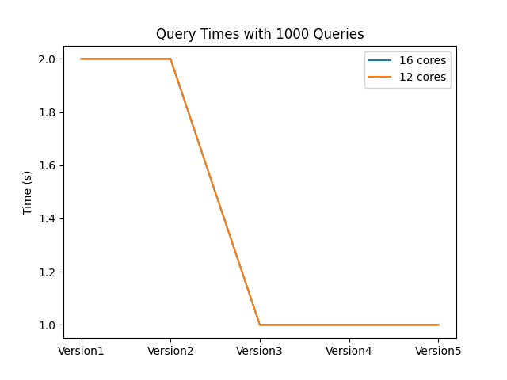
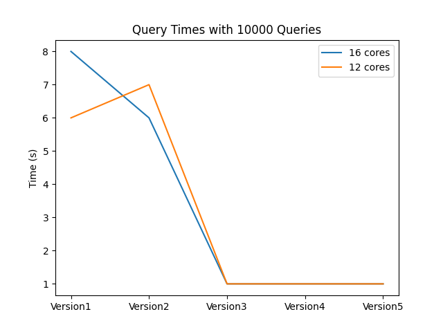
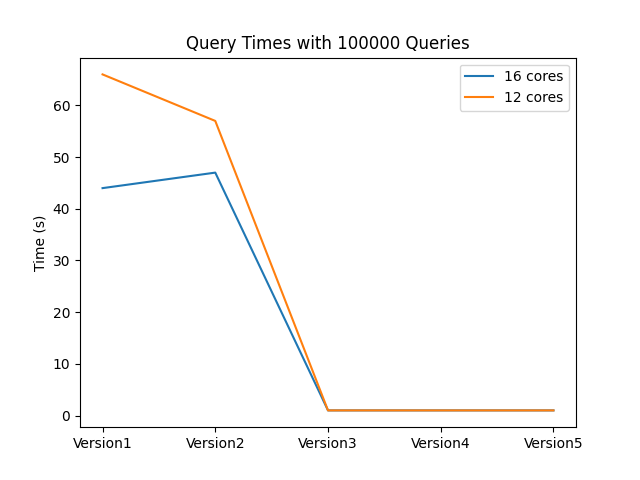
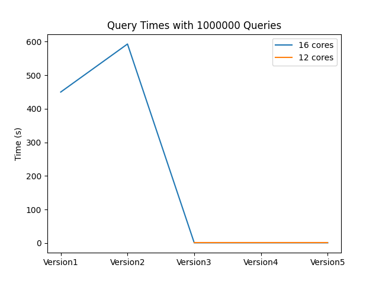

# Project 2 MultiCore Computing

## Fall Semester 2021

_Giovanni Villalobos, Jacob Tronge_

Below are test results for testing each version on two different computers.

### Query Time Benchmarks

Below are the query time results for running 1000, 10000, 100000 and 1000000
random queries for each of the five versions.

Our evaluation was done on two different computers, one with 12 cores and one
with 16 cores. You can see a small amount of speedup for the computer with 16
cores. For the last 10000000-count query, Version1, Version2 and Version3 were
too slow and we weren't able to run them to completion.

You can also see that for low query counts, there is not a huge difference
between the versions. However as we increase the query count, the performance
difference becomes much more apparent as the query time grows for the
non-parallel versions while remaining low for the parallel versions.

Note: we didn't try to do any of the above & beyond code. We implemented the 5
different versions as required.

### Development Process

To write the code, we each worked on different versions and then would come
together in a meeting to merge the code. In this way we made sure that it would
work correctly on both of our systems.
